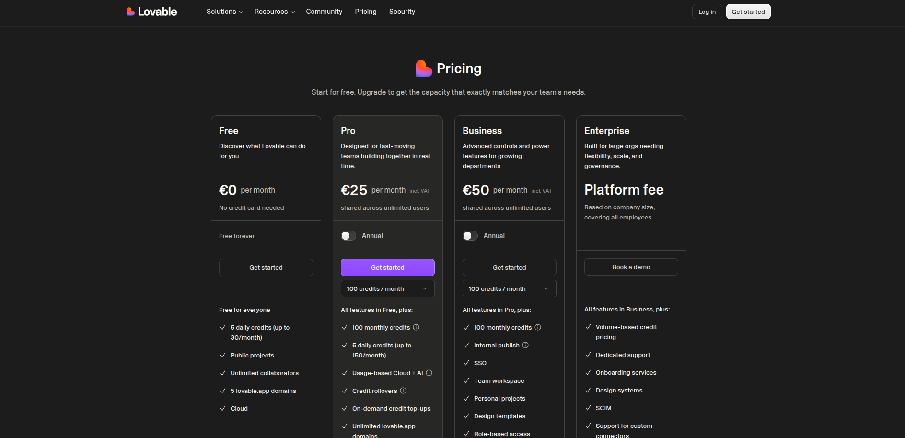

Lovable AI is zo'n tool waarbij je binnen een paar minuten denkt: oké, dit gaat hard.

Je beschrijft een idee, stuurt wat bij, en er staat opeens iets dat niet voelt als een losse schets maar als een echte eerste versie. Een dashboard. Een portal. Een tooltje waar iemand daadwerkelijk op zou kunnen inloggen en mee werken. Dat is ook precies waarom Lovable zoveel aandacht krijgt.

Alleen gaat het in veel artikelen daarna mis.

Of de tekst schiet meteen in bewonderingstand, of hij blijft hangen in vage uitleg. Dan lees je dingen als "met Lovable bouw je websites en apps met AI", maar nog steeds weet je niet echt waar je aan toe bent. Wat zit er onder de motorkap? Wanneer is het slim? Wanneer juist niet? Wat kost het? En is het voor een SEO-site nou handig of juist helemaal niet?

Daar probeer ik verandering in te brengen.

## Wat is Lovable AI precies?

Lovable AI is een AI-tool waarmee je websites en vooral webapps kunt laten opzetten op basis van gewone taal. Je typt wat je wilt bouwen, geeft richting, en Lovable genereert vervolgens code, interface en een deel van de logica.

Dat laatste is belangrijk.

Het is dus niet alleen een visuele websitebouwer met vaste blokken. Lovable bouwt aan echte code en werkt daarbij vooral met **React, Tailwind en Vite** aan de front-end. Voor data en authenticatie kan het koppelen met **Supabase** of met Lovable Cloud. Je kunt projecten publiceren, een custom domain koppelen en via **GitHub** de code exporteren en zelf verder beheren.

Dat maakt het onderscheid meteen een stuk concreter.

Lovable is geen klassieke no-code tool, maar ook geen gewone code-editor. Het zit meer in de hoek van AI app builders die een werkende basis voor je neerzetten, terwijl jij vooral stuurt, test en bijschaaft.

## Wat Lovable anders maakt dan klassieke websitebouwers

Een standaard websitebouwer is vaak prima zolang je een normale site nodig hebt. Homepage, dienstenpagina, contactformulier, klaar. Maar zodra je iets wilt met accounts, data, gebruikersrollen, formulieren die echt iets doen of een tool waar mensen terugkomen, kom je al snel in een andere categorie terecht.

Daar wordt Lovable interessanter.

Je kunt er namelijk niet alleen een voorkant mee maken, maar ook de basis van een echte webapp. Denk aan een klantportaal, een intake-tool, een ledenomgeving, een SaaS-MVP of een dashboard met opgeslagen gebruikersdata.

Het verschil zit dus niet in "de ene tool voelt moderner dan de andere". Het verschil zit in wat er feitelijk gebeurt: Lovable genereert code, kan met backend-oplossingen werken, laat je syncen met GitHub en is duidelijk meer gericht op apps en workflows dan op simpele contentsites.

## Voor wie Lovable interessant is en voor wie niet

Lovable AI is vooral interessant voor mensen die snel willen testen, bouwen en doorpakken.

Bijvoorbeeld voor:

- ondernemers met een SaaS-idee
- marketeers die een leadtool of interactieve calculator willen bouwen
- kleine teams die een intern dashboard nodig hebben
- bureaus die sneller een prototype willen laten zien
- makers die een klantenportaal of niche-tool willen opzetten

Maar het is niet automatisch voor iedereen een goede keuze.

Wil je vooral een website met veel content, blogpagina's, lokale landingspagina's, categorieën, interne links en een soepele redactieworkflow? Dan zit je vaak gewoon beter met WordPress.

Wil je een technisch zwaar platform bouwen met veel maatwerk, diepe businesslogica of uitzonderlijke security-eisen? Dan kom je waarschijnlijk ook uit op een meer traditionele ontwikkelroute.

Lovable zit vooral goed in het midden: sneller dan vanaf nul bouwen, serieuzer dan een standaard sitebuilder.

## De grootste voordelen van Lovable AI

Lovable heeft duidelijke pluspunten.

### Snel van idee naar eerste versie

Dit is de grote kracht. Je kunt in relatief korte tijd iets neerzetten dat testbaar is.

### Lager instappunt dan traditioneel bouwen

Je hoeft niet alles zelf vanaf nul te coderen om toch een serieus begin te maken.

### Sterk voor validatie

Voor veel ideeën is een perfecte versie helemaal niet de eerste stap. Eerst wil je weten: snappen mensen het, gebruiken ze het en willen ze ervoor betalen?

### Echte code en eigendom

Je werkt niet alleen in een gesloten blokkendoos. Lovable geeft aan dat jij als maker eigenaar bent van je project en code, en via GitHub kun je die code exporteren.

Dat maakt de tool meteen serieuzer.

## De nadelen en beperkingen waar je rekening mee moet houden

Natuurlijk zitten er ook grenzen aan.

### Mooie output is nog geen goed product

Lovable kan snel iets neerzetten dat er overtuigend uitziet. Maar een overtuigend scherm is nog geen sterke gebruikersflow. UX, foutafhandeling, structuur en businesslogica blijven gewoon jouw verantwoordelijkheid.

### Complexiteit stapelt zich op

De eerste 60 procent voelt vaak lekker. Daarna komen de lastige stukken: rollen, randgevallen, datamodellen, permissions, betalingen, onderhoud.

Daar merk je pas of je project echt goed in elkaar zit.

### Je moet nog steeds keuzes kunnen maken

Deze tool vervangt geen productinzicht. Niet elk idee verdient een functie. Niet elk scherm hoeft erin. Soms is schrappen de beste verbetering.

### Niet ideaal voor elk type site

Voor een app of tool kan Lovable heel sterk zijn. Voor een contentsite, kennisbank of SEO-gedreven website vaak een stuk minder logisch.

## Is Lovable AI geschikt voor beginners?

Ja, maar niet op de sprookjesversie van "je typt iets en je bedrijf staat morgen live".

Je hoeft geen developer te zijn om met Lovable te werken. Dat is juist de charme. Maar je moet wel helder kunnen denken. Rollen onderscheiden. Een flow logisch opbouwen. En vooral klein durven beginnen.

Wie ik hierin vast zie lopen, doet meestal één van deze dingen:

- te groot starten
- te vage prompts geven
- een eerste versie aanzien voor een eindproduct

Als je die drie valkuilen vermijdt, kom je al verrassend ver.

## Lovable en SEO: hoe goed is het voor vindbaarheid?

Hier moet je niet omheen draaien.

Lovable kan je helpen om snel iets te bouwen, maar dat maakt het nog niet automatisch de beste keuze voor SEO. Zeker niet als content en organisch verkeer de kern van je project zijn.

Voor dat soort websites blijft **WordPress** in veel gevallen gewoon beter.

Niet moderner. Niet spannender. Wel beter.

### Waarom WordPress vaak sterker is voor SEO-sites

Bij Lovable kom je al snel uit op een React-achtige app-structuur. Voor tools en interactieve flows is dat prima. Voor een contentsite is het vaak minder handig.

Waarom? Omdat je voor SEO meestal juist baat hebt bij dingen als:

- stabiele URL-structuren
- makkelijke publicatie van nieuwe content
- categorieën en tags
- interne linkstructuren
- sitemaps
- volwassen SEO-plugins
- redactieworkflows
- schaalbaar beheer van tientallen of honderden pagina's

WordPress is daar simpelweg veel volwassener in.

En er is nog iets dat technisch zwaarder weegt.

Bij een klassieke React SPA wordt content vaak pas volledig opgebouwd in de browser. Dat betekent dat Google de pagina eerst moet ophalen en daarna in een tweede fase moet renderen voordat alle inhoud echt zichtbaar is voor indexatie. Dat is minder direct en minder robuust dan een server-rendered WordPress-pagina die meteen volledige HTML serveert.

Voor een tool of app is dat vaak prima. Voor een blog, lokale dienstensite of kennisbank is het meestal gewoon niet de handigste route.

Dus ja, je kunt met Lovable een SEO-site bouwen.

Maar de betere vraag is: waarom zou je, als WordPress voor dat type project meestal praktischer is?

### Waar Lovable wél prima kan werken

Als je een tool, calculator, portaal, quiz, intakeflow of interactieve leadmagneet bouwt, ziet de afweging er anders uit. Dan draait het minder om honderd contentpagina's en meer om functionaliteit.

Daar kan Lovable juist een slimme keuze zijn.

## Integraties: wat kun je koppelen?

De techniek van Lovable is één ding. Wat je eraan kunt hangen is minstens zo belangrijk.

Lovable ondersteunt onder meer:

- **Supabase** voor data en auth
- **Stripe** voor betalingen
- externe API's zoals OpenAI en andere diensten
- **GitHub** om code over te zetten en verder zelf te beheren
- publicatie op je eigen domein

Belangrijk detail: gevoelige API-sleutels moet je niet zomaar in Lovable plakken. Lovable adviseert juist om secrets via Lovable Cloud of Supabase te beheren, bijvoorbeeld in combinatie met Edge Functions.

Dat soort details zijn misschien niet sexy, maar wel precies de dingen die bepalen of een project later netjes uitbreidbaar blijft.

## Wat kost Lovable AI?

Op het moment van schrijven heeft Lovable een **gratis plan** en betaalde plannen zoals **Pro** en **Business**. Volgens de officiële pricing-informatie zit **Pro op 25 euro per maand** bij jaarlijkse betaling, met **100 credits per maand**, plus **5 dagelijkse credits** die kunnen oplopen tot maximaal **150 per maand**. Het **gratis plan** heeft **5 daily credits** met een maandcap. Business begint op **50 euro per maand** bij jaarlijkse betaling. Enterprise is maatwerk.

Daarnaast werkt Lovable met een **creditsysteem**. Je gebruikt credits voor berichten en acties in de tool. Er zijn ook **credit rollovers** en **on-demand top-ups** op betaalde plannen.

De praktische vertaling is simpel. Voor een korte test of een kleine proof of concept kan Free genoeg zijn. Ga je echt een MVP bouwen en daar twee weken of langer serieus mee itereren, dan kom je al snel uit bij Pro.

Dat maakt ook meteen duidelijk waarom slim werken zoveel scheelt. Als je zonder scope blijft rondklikken en alles tien keer omgooit, voelt Lovable sneller duur. Werk je scherp en gefaseerd, dan kan het juist goedkoop zijn vergeleken met maatwerk.

## Van idee naar live project: een slim proces

Wie Lovable goed wil gebruiken, doet er slim aan om niet meteen de hele droomversie te willen bouwen.

Een betere volgorde is meestal:

### Stap 1: schrijf het idee uit in gewone taal

Wat is het probleem, wie gebruikt het en wat moet iemand in de eerste versie kunnen doen?

### Stap 2: laat alleen de basis bouwen

Dus eerst de kernflow. Niet meteen ook betalingen, mailflows, adminrollen, notificaties en analyses.

### Stap 3: voeg daarna pas extra logica toe

Login, rollen, database, API-koppelingen, betalingen. Pas als de basis klopt.

### Stap 4: test als een echte gebruiker

Waar loop je vast? Wat voelt onduidelijk? Wat is overbodig? Wat mist?

### Stap 5: verfijn daarna pas design en details

Niet andersom.

Dat laatste voelt tegenintuïtief, maar is vaak precies het verschil tussen snel iets bruikbaars bouwen en eindeloos blijven poetsen op iets wat inhoudelijk nog niet klopt.

## Voor welke projecten is Lovable echt een goede keuze?

Lovable is vooral sterk als snelheid en iteratie zwaarder wegen dan volledige controle vanaf dag één.

Bijvoorbeeld voor:

- een SaaS-MVP
- een klantportaal
- een intern dashboard
- een niche-tool
- een offerte- of intakeflow
- een calculator of leadtool
- een appconcept dat je eerst met echte gebruikers wilt testen

Dat zijn stuk voor stuk situaties waarin "snel iets werkends hebben" veel waard is.

## Wanneer kun je beter een alternatief kiezen?

Niet elk project vraagt om Lovable.

Wil je vooral een website met veel content en sterke organische vindbaarheid? Dan is WordPress vaak logischer.

Werk je liever direct in een code-editor en wil je veel meer controle? Dan kom je eerder uit bij iets als Cursor.

Wil je vooral frontend en UI-componenten genereren voor een moderne React- of Next.js-workflow? Dan is v0 weer interessanter.

En wil je juist in de browser full-stack bouwen met een ontwikkelomgeving eromheen, dan komen Bolt en Replit in beeld.

## Lovable alternatieven: wat is het concrete verschil?

Hier wordt online vaak veel te vaag over geschreven. Dus laten we het gewoon scherp trekken.

### Lovable vs v0

v0 is van **Vercel** en staat vooral bekend om het genereren van UI en componenten voor moderne webprojecten. Het sluit sterk aan op een frontend-workflow rond **React**, **Next.js** en componentgedreven bouwen. Het is dus heel interessant als je design, componentstructuur en frontend-code centraal wilt zetten.

Lovable denkt meer vanuit het hele product en de flow. Minder alleen componenten, meer complete app-opzetten.

Kort gezegd: wil je vooral UI en frontendversnelling, dan is v0 sterk. Wil je sneller naar een complete app-achtige eerste versie, dan voelt Lovable vaak logischer.

### Lovable vs Bolt

Bolt.new komt uit de hoek van **StackBlitz** en draait op browsergebaseerde ontwikkeltechniek via **WebContainers**. Het is veel meer gericht op direct bouwen en draaien in de browser, met een full-stack feel.

Bolt is sterk als je een snellere browsergebaseerde ontwikkelomgeving wilt waarbij je app direct draait en je dichter op het ontwikkelproces zit. Lovable voelt meer als een productbuilder die je helpt om sneller van idee naar werkende opzet te gaan.

### Lovable vs Cursor

Cursor is geen app-builder zoals Lovable. Het is in de kern een **AI-code-editor / IDE**. Dus niet: "bouw dit product voor me", maar eerder: "help me dit project in code sneller bouwen en aanpassen".

Dat verschil is groot.

Ben je developer, of werk je graag dicht op code, bestanden, architectuur en debugging, dan is Cursor vaak de logischere keuze. Lovable is juist aantrekkelijker voor mensen die minder vanuit code en meer vanuit product, flow en eerste versie denken.

### Lovable vs Replit

Replit positioneert zich als een platform om apps te bouwen en publiceren vanuit één browsertab, met coding, publishing en samenwerking in één omgeving. Het is dus meer dan alleen prompten; het is ook echt een ontwikkelomgeving in de browser.

Replit is interessant als je iets meer wilt sleutelen, deployen en werken in een complete browser-based dev omgeving. Lovable voelt voor veel gebruikers toegankelijker als startpunt wanneer het doel vooral is: snel een appconcept neerzetten.

### Lovable vs WordPress

Deze vergelijking wordt vaak vergeten, maar is voor veel ondernemers juist heel relevant.

Wil je een blog, lokale dienstenwebsite, affiliate site, kennisbank of andere contentgedreven site bouwen? Dan is WordPress nog steeds vaak de betere keuze. Gewoon omdat publiceren, structureren, optimaliseren en beheren daar vaak soepeler gaat.

Lovable wint niet omdat het nieuwer voelt. De beste tool is de tool die past bij het soort project dat je bouwt.

## Veelgemaakte fouten bij het gebruiken van Lovable

Er zijn een paar missers die steeds terugkomen.

### Te groot beginnen

Meteen een compleet platform willen bouwen is meestal vragen om ruis.

### Te vaag prompten

Hoe wolliger jouw opdracht, hoe losser de uitkomst.

### Geen onderscheid maken tussen prototype en productie

Een werkende eerste versie is nog geen volwassen product.

### Alles willen houden

Soms is het slimste wat je kunt doen gewoon iets weghalen.

### SEO en content onderschatten

Dat een tool of website technisch staat, betekent nog niet dat hij goed rankt, prettig leest of logisch beheerd kan worden.

## Mijn eerlijke oordeel over Lovable AI

Lovable AI is absoluut interessant.

Niet omdat het zogenaamd alles oplost, maar omdat het de stap van idee naar eerste werkende versie flink kleiner maakt. Daar zit de echte waarde. Minder eindeloos praten. Sneller iets zien. Sneller testen. Sneller merken waar het schuurt.

Maar die kracht werkt alleen als jij ook scherp bent.

Wie vaag blijft, krijgt vage output. Wie te groot begint, creëert snel chaos. En wie denkt dat een strakke interface automatisch betekent dat het product goed is, komt later vanzelf de rekening tegen.

Gebruik je Lovable voor waar het sterk in is, dan kan het een serieuze versneller zijn. Vooral bij MVP's, interne tools, portals, calculators en andere functionele webapps.

Gebruik je het voor een contentsite of SEO-project waarbij publicatie, structuur en schaalbaar contentbeheer de hoofdzaak zijn, dan is WordPress in veel gevallen gewoon de verstandigere keuze.

Niet hipper. Wel slimmer.

## Conclusie: is Lovable AI de moeite waard?

Ja, Lovable AI kan absoluut de moeite waard zijn.

Vooral als je snel iets wilt bouwen dat meer is dan een statische website. Een tool. Een portal. Een dashboard. Een eerste versie van een SaaS. Dan is het serieus interessant.

Maar het is geen vervanging voor productkeuzes, afbakening en logisch nadenken. Sterker nog: juist die dingen bepalen of je hier veel aan hebt.

En misschien is dat meteen de beste samenvatting.

Lovable is sterk gereedschap. Maar nog steeds gereedschap.

Vond je dit nou een handig artikel en wil je meer weten over de laatste AI tools? Op [Balderstone.nl](https://balderstone.nl) schrijf ik regelmatig meer, dus neem daar gerust eens een kijkje!
