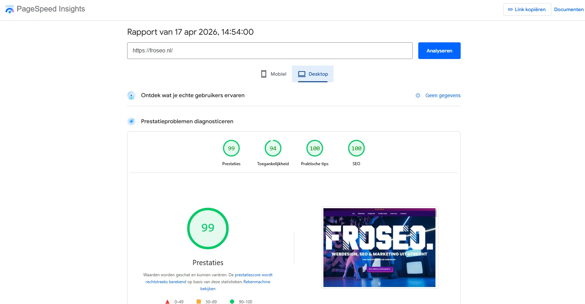
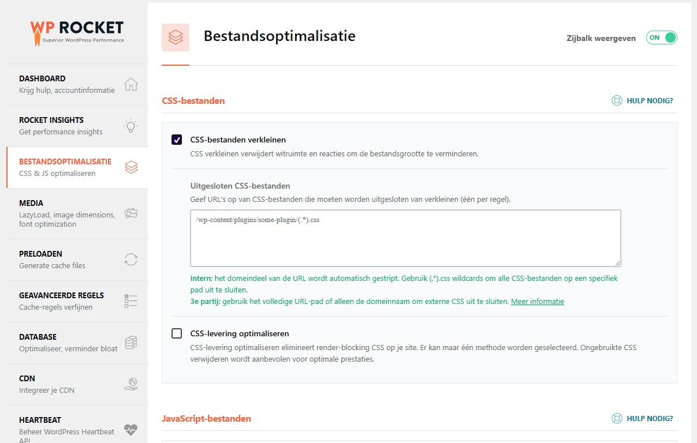
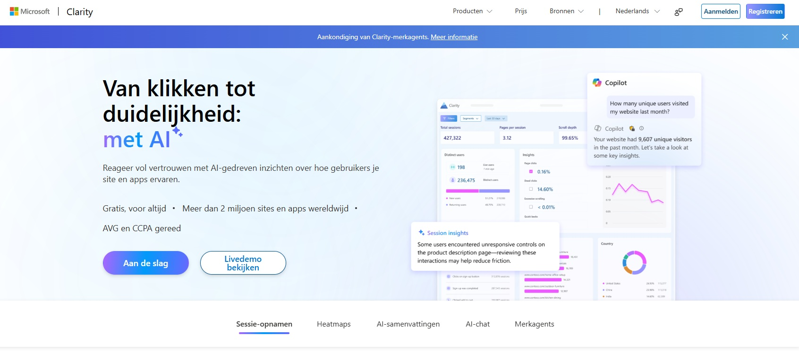

Een goede website is niet alleen mooi of vindbaar, maar ook snel, duidelijk en gericht op resultaat. Snellere website, minder afhakers, meer duidelijkheid, meer bezoekers en uiteindelijk meer aanvragen. In deze gids lopen we de vijf pijlers van website optimalisatie langs: techniek, UX, conversie, content en SEO.

## Wat is website optimalisatie en wanneer heeft jouw site het nodig?

Website optimalisatie is breder dan SEO. Het gaat niet alleen om beter gevonden worden in Google, maar ook om snelheid, duidelijkheid, gebruiksvriendelijkheid, content en conversie. Juist daar gaat het op veel websites mis. Ze zien er prima uit, maar laden te traag, sturen te weinig, zeggen net niet genoeg of voelen op mobiel minder sterk dan op desktop.

Dat merk je meestal niet aan één grote fout. Vaker is het een optelsom. Je krijgt wel bezoekers, maar weinig aanvragen. Je homepage vertelt best veel, maar niet snel genoeg wat je precies doet. Pagina's ogen verzorgd, maar overtuigen niet echt. Of de site voelt gewoon net niet scherp genoeg.

En precies daarom loont website optimalisatie zo vaak. Zonder meteen een compleet redesign te starten, kun je vaak al veel verbeteren. Soms technisch. Soms inhoudelijk. Soms zit de winst juist in de structuur of in de manier waarop een pagina bezoekers naar de volgende stap begeleidt.

De meeste websites laten daarbij op dezelfde plekken kansen liggen. Daarom is het handig om het onderwerp op te delen in vijf pijlers.

## De 5 pijlers van website optimalisatie

Tijd om die vijf pijlers eens goed uit te leggen. Nog belangrijker: wat kun je per onderdeel concreet verbeteren?

### Pijler 1: Techniek

Techniek is de fundering van je website. Als die niet klopt, merk je dat overal in terug. Pagina's laden trager, mobiel voelt stroef, formulieren werken net niet lekker en zelfs goede content of sterke SEO komt minder goed tot zijn recht.

Het goede nieuws: juist op technisch vlak is vaak relatief snel winst te halen. Niet door blind achter een PageSpeed-score aan te rennen, maar door de grootste remmers gericht aan te pakken.

#### Verbeter eerst je laadsnelheid, niet alleen je score

Veel mensen openen PageSpeed Insights, zien een cijfer en raken meteen gefixeerd op groen. Alleen zegt die score op zichzelf niet zoveel. Belangrijker is waar de vertraging precies zit.

Vaak zijn dat geen ingewikkelde dingen, maar herkenbare oorzaken zoals te zware afbeeldingen, video's die direct boven de vouw laden, te veel plugins, tracking scripts van allerlei tools en CSS of JavaScript die alles meteen probeert in te laden.

Begin daarom met de grootste remmers. Maak afbeeldingen kleiner, zet video's pas aan als iemand klikt, verwijder onnodige plugins en kijk kritisch naar scripts die weinig opleveren. Daar zit meestal meer winst in dan in eindeloos micromanagen op een rapportcijfer.

**Handige tools:** [Google PageSpeed Insights](https://pagespeed.web.dev/), [GTmetrix](https://gtmetrix.com/), TinyPNG, ShortPixel.

#### Gebruik caching en optimalisatie-tools als je op WordPress werkt

Als je website op WordPress draait, hoef je niet alles handmatig op te lossen. Tools kunnen veel technische optimalisatie al voor je opvangen, zolang je ze slim gebruikt.

Een plugin als [WP Rocket](https://wp-rocket.me/) is daar een goed voorbeeld van. Daarmee kun je caching inschakelen, bestanden laten optimaliseren, lazy loading gebruiken en bepaalde scripts later laten laden. Dat kan echt verschil maken, vooral bij bestaande websites die in de loop der jaren zwaarder zijn geworden.

Wel belangrijk: zet niet zomaar elke optie aan omdat het kan. Test na elke wijziging of je site nog goed werkt. Sommige instellingen lijken slim, maar kunnen ook problemen geven met sliders, menu's of formulieren.

**Praktisch:** voeg niet drie verschillende performance-plugins tegelijk toe. Kies liever één duidelijke oplossing en houd het beheersbaar.

#### Comprimeer afbeeldingen en denk na over bestandstype

Afbeeldingen zijn op veel websites nog steeds een van de grootste oorzaken van traagheid. En dat is zonde, want dit is vaak makkelijk op te lossen.

Wat je wilt voorkomen: foto's van meerdere MB's, afbeeldingen die veel groter zijn dan nodig, PNG-bestanden waar een JPG of WebP prima zou werken en tien grote sfeerbeelden boven elkaar op één pagina.

Wat je beter wel kunt doen: verklein afbeeldingen voordat je ze uploadt, comprimeer ze, gebruik waar mogelijk WebP en laad alleen de belangrijkste afbeelding direct in.

**Niet:** een hero-afbeelding van 3200 pixels breed uploaden en hopen dat WordPress het wel oplost.

**Wel:** eerst terugbrengen naar een logisch formaat, comprimeren en daarna pas uploaden.

#### Test je website echt op mobiel

Een site kan op desktop prima ogen en op mobiel alsnog frustrerend zijn. Juist daar gaat het vaak mis. Een menu dat onhandig opent, knoppen die te dicht op elkaar staan, tekst die te klein is, sticky elementen die irritant in beeld hangen of formulieren die onnodig lang aanvoelen.

Test daarom niet alleen in een builder of preview-modus. Pak gewoon je telefoon erbij. Klik door je homepage, dienstenpagina's en contactformulier alsof je zelf een nieuwe bezoeker bent.

Let vooral op of direct duidelijk is wat je doet, of het menu prettig werkt, of knoppen goed klikbaar zijn, of de pagina rustig genoeg blijft en of het formulier haalbaar voelt.

#### Ruim technische rommel op die zich heeft opgestapeld

Bestaande websites verzamelen in de loop van de tijd vaak van alles. Oude plugins. Scripts van tools die ooit getest zijn. Verwijzingen naar pagina's die niet meer bestaan. Dubbele functionaliteit. Redirects op redirects.

Dat maakt een site niet alleen trager, maar ook kwetsbaarder en lastiger te onderhouden. Loop daarom af en toe je technische basis langs. Welke plugins gebruik je echt nog? Zijn er broken links? Staan er scripts aan die niets meer doen? Werken formulieren nog goed? Is alles up-to-date?

**Handige tools:** [Screaming Frog](https://www.screamingfrog.co.uk/seo-spider/), Broken Link Checker en je plugin-overzicht in WordPress zelf.

#### Zorg dat de basis stabiel en veilig blijft

Techniek gaat niet alleen over snelheid. Een website moet ook gewoon betrouwbaar aanvoelen en goed blijven werken. Denk aan een geldig SSL-certificaat, regelmatige updates, back-ups, formulieren die daadwerkelijk aankomen en geen foutmeldingen op belangrijke pagina's.

Dit klinkt misschien minder spannend dan laadsnelheid, maar juist dit soort dingen bepalen of een website professioneel overkomt. Een snelle site met een kapot formulier blijft gewoon een slechte website.

Techniek hoeft dus niet meteen een groot of ingewikkeld traject te zijn. Vaak zit de eerste winst gewoon in slimmer opschonen, comprimeren, testen en de grootste remmers aanpakken.

### Pijler 2: Gebruiksvriendelijkheid (UX)

Een website kan er goed uitzien en toch onhandig zijn in gebruik. Dat merk je meestal niet omdat één ding compleet fout gaat, maar omdat bezoekers net te veel moeten nadenken. Waar moet ik klikken? Wat doen ze precies? Waarom voelt dit zo druk?

Goede UX haalt die frictie weg. Niet met trucjes, maar door dingen duidelijker, logischer en rustiger te maken.

#### Maak boven de vouw meteen duidelijk wat je doet

Op veel websites moet een bezoeker eerst scrollen, lezen en interpreteren voordat duidelijk wordt wat het bedrijf eigenlijk aanbiedt. Dat is zonde, want juist de eerste paar seconden bepalen of iemand verder kijkt of afhaakt.

Zorg dus dat je boven de vouw snel antwoord geeft op drie vragen: wat doe je, voor wie en wat levert het op?

**Niet:** "Digitale oplossingen voor ambitieuze merken."

**Wel:** "Wij bouwen en optimaliseren WordPress-websites die sneller laden, duidelijker sturen op aanvragen en beter gevonden worden in Google."

**Check:** kun je als nieuwe bezoeker binnen vijf seconden snappen wat het bedrijf doet?

#### Maak je navigatie simpeler dan je zelf denkt dat nodig is

Een menu lijkt vaak logisch als je er dagelijks naar kijkt. Voor een nieuwe bezoeker werkt dat anders. Te veel items, vage benamingen of dubbele routes zorgen er al snel voor dat iemand moet zoeken.

Houd je hoofdmenu daarom strak. Laat alleen zien wat echt belangrijk is en gebruik woorden die direct iets zeggen. "Diensten" is meestal duidelijker dan "Oplossingen". "Website laten maken" vaak sterker dan "Onze aanpak".

Kijk ook of pagina's logisch gegroepeerd zijn. Als iemand via je homepage, diensten en contactpagina alsnog moet puzzelen hoe alles samenhangt, dan zit daar meestal winst.

**Handige tools:** [Microsoft Clarity](https://clarity.microsoft.com/), [Hotjar](https://www.hotjar.com/) of een simpele gebruikerstest met iemand die je site niet kent.

#### Zorg dat pagina's scanbaar blijven

De meeste mensen lezen een website niet van boven naar beneden. Ze scannen. Juist daarom moet een pagina ook in dat gedrag goed blijven werken.

Wat helpt: duidelijke tussenkoppen, kortere alinea's, opsommingen waar dat iets toevoegt, genoeg witruimte en belangrijke zinnen niet verstoppen in een lap tekst.

Wat niet helpt: alles in dezelfde tekstdichtheid, drie lange alinea's achter elkaar zonder ritme, koppen die weinig zeggen en te veel tekst boven elkaar zonder visuele pauze.

**Check:** kun je de kern van de pagina begrijpen als je alleen de koppen en eerste zinnen leest?

#### Maak belangrijke acties makkelijk vindbaar

Bezoekers hoeven niet overal meteen op te klikken. Maar als iemand wel klaar is voor actie, moet die stap niet verstopt zitten.

Zorg daarom dat belangrijke knoppen logisch in beeld komen. Niet alleen één keer bovenaan, maar ook op plekken waar iemand genoeg informatie heeft gezien om verder te willen. Denk aan na een dienstenintro, onder een belangrijk tekstblok, na bewijs of klantcases en onderaan een pagina.

**Niet:** "Versturen"

**Wel:** "Vraag een gratis website check aan" of "Plan een vrijblijvende kennismaking"

#### Test je site alsof je hem nog nooit hebt gezien

Dit klinkt simpel, maar gebeurt opvallend weinig. De eigenaar of maker kent de website al te goed. Daardoor vallen onduidelijkheden minder snel op.

Loop daarom af en toe je eigen site door met frisse ogen. Of laat iemand meekijken die je aanbod niet van binnen en buiten kent. Vraag diegene om één simpele taak uit te voeren, bijvoorbeeld uitzoeken wat je precies aanbiedt, een belangrijke dienst vinden of contact opnemen.

Waar iemand begint te twijfelen, zit vaak precies de UX-winst.

Goede UX voelt bijna vanzelfsprekend. Juist dat maakt het zo verraderlijk. Als het niet klopt, merk je het vaak pas aan alles wat net niet gebeurt: minder doorkliks, minder vertrouwen en minder aanvragen.

### Pijler 3: Conversie

Veel websites zijn best informatief, maar sturen te weinig. Er staat van alles op de pagina, alleen niet op een manier die iemand echt helpt om de volgende stap te zetten. En precies daar gaat conversie over.

Je hoeft daarvoor niet schreeuwerig of salesy te worden. Maar een pagina moet wel duidelijk maken wat iemand hierna kan doen, waarom dat logisch is en waarom jij te vertrouwen bent.

#### Maak je call-to-actions concreter

Een knop als "Lees meer", "Verzenden" of "Neem contact op" kan prima werken, maar is vaak net te algemeen. Zeker op belangrijke pagina's mag een CTA veel duidelijker zeggen wat iemand krijgt.

**Niet:** "Verzenden"

**Wel:** "Vraag een gratis website check aan" of "Plan een vrijblijvende kennismaking"

Kijk ook of je CTA aansluit op het moment in de pagina. Bovenaan is iemand vaak nog aan het oriënteren. Lager op de pagina, na uitleg of bewijs, mag je CTA best directer worden.

#### Voeg bewijs toe op plekken waar twijfel ontstaat

Twijfel is normaal. Zeker als iemand je nog niet kent. Daarom werken reviews, cases, resultaten, klantlogo's of korte praktijkvoorbeelden zo goed.

Zet die niet ergens verstopt op een losse pagina, maar juist op de plekken waar iemand een beslissing probeert te nemen. Bijvoorbeeld op een dienstenpagina, onder een prijsblok of vlak voor een contactmoment.

**Niet:** alleen zeggen dat je goed bent.

**Wel:** laten zien wat je hebt gedaan en wat dat opleverde.

#### Maak formulieren korter en minder zwaar

Veel formulieren vragen te veel, te vroeg. Bedrijfsnaam, telefoonnummer, budget, type project, planning, extra toelichting en het liefst ook nog een paar verplichte velden ertussen. Dat schrikt af.

Vraag liever alleen wat nodig is om het gesprek te starten. Naam, e-mailadres en een korte toelichting is vaak al genoeg. De rest kun je later altijd nog bespreken.

**Goede vuistregel:** hoe lager de drempel, hoe groter de kans dat iemand hem neemt.

#### Zorg dat elke belangrijke pagina één duidelijke volgende stap heeft

Sommige pagina's willen te veel tegelijk. Ze moeten informeren, overtuigen, SEO-waarde hebben, het merkverhaal vertellen en converteren. Gevolg: de bezoeker blijft hangen in lezen, maar weet niet echt wat nu de bedoeling is.

Bepaal daarom per pagina wat de hoofdactie is. Bijvoorbeeld contact opnemen, een dienst bekijken, een offerte aanvragen of een kennismaking plannen. Die stap moet daarna logisch terugkomen in de opbouw van de pagina.

**Handige tools:** [GA4](https://analytics.google.com/), Microsoft Clarity, Hotjar.

#### Kijk waar mensen afhaken en test daarna gericht

Conversie verbeteren doe je niet alleen op gevoel. Kijk in je data waar bezoekers stoppen, niet klikken of je formulier niet afmaken. Dat vertelt vaak meer dan nog een extra CTA-blok toevoegen.

Zodra je ziet waar het spaak loopt, kun je gerichter testen. Bijvoorbeeld met een scherpere kop, een andere CTA, een korter formulier, meer bewijs boven de vouw of een andere volgorde van secties.

Je hoeft niet meteen groots te A/B-testen, maar het helpt wel om gericht te verbeteren in plaats van maar wat aan te passen.

Een pagina converteert meestal niet beter door één magische knop. Vaker is het een optelsom van kleine verbeteringen die samen meer richting, vertrouwen en duidelijkheid geven.

### Pijler 4: Content

Tekst is op veel websites óf te vaag, óf te vol. En soms allebei. Er staat dan best veel, maar weinig dat echt blijft hangen of iemand helpt om sneller te begrijpen waarom hij hier goed zit.

Goede content hoeft niet langer te zijn. Wel duidelijker, concreter en beter afgestemd op wat een bezoeker wil weten.

#### Vervang algemene marketingtaal door concrete taal

Veel websites gebruiken zinnen die op papier prima klinken, maar in de praktijk weinig zeggen. Denk aan "Wij bieden maatwerkoplossingen", "Kwaliteit staat bij ons centraal" of "Wij ontzorgen van A tot Z".

Het probleem is niet dat die zinnen fout zijn. Ze zijn vooral te algemeen. Een concurrent kan precies hetzelfde zeggen.

**Niet:** "Wij bieden maatwerk websites."

**Wel:** "We bouwen en optimaliseren WordPress-websites die sneller laden, duidelijker sturen op aanvragen en beter werken op mobiel."

**Niet:** "Kwaliteit staat bij ons centraal."

**Wel:** "Je krijgt bij ons geen standaard template, maar een website die is opgebouwd rond jouw diensten, doelgroep en conversiedoel."

#### Geef elke pagina één duidelijk doel

Een homepage heeft een andere taak dan een dienstenpagina. Een blogpagina weer een andere dan een contactpagina. Toch proberen veel websites op elke pagina alles tegelijk te doen. Dat maakt teksten vaak rommelig.

Bepaal daarom eerst het doel van de pagina. Moet iemand begrijpen wat je doet? Een specifieke dienst overwegen? Contact opnemen? Doorklikken? Pas daarna schrijf je de inhoud.

**Check:** kun je in één zin uitleggen wat deze pagina van de bezoeker wil?

#### Maak je koppen en intro's harder werkend

De meeste bezoekers lezen geen pagina van boven tot beneden. Ze scannen eerst. Juist daarom doen je koppen, intro's en eerste scherm veel zwaar werk. Vage koppen helpen dan niet.

**Niet:** "Onze aanpak", "Wat wij doen" of "Slimme oplossingen voor jouw groei"

**Wel:** "Website laten maken die sneller laadt en beter converteert", "Waarom je WordPress-website weinig aanvragen oplevert" of "Zo optimaliseer je je website zonder meteen opnieuw te beginnen"

#### Schrijf voor de bezoeker, niet vanuit jezelf

Veel websites vertellen vooral wat het bedrijf zelf belangrijk vindt. Hoe lang ze bestaan, hoe betrokken ze zijn, hoe persoonlijk ze werken. Dat mag best terugkomen, maar niet als hoofdlijn van de pagina.

Begin liever bij de bezoeker. Waar loopt die tegenaan? Wat wil die snappen? Welke twijfel heeft die? Welke uitkomst zoekt die?

**Niet:** "Wij zijn een enthousiast team met passie voor online."

**Wel:** "Als je website wel bezoekers trekt maar nauwelijks aanvragen oplevert, zit het probleem vaak niet in je verkeer maar in je pagina's."

#### Schrap ruis en herhaling

Een pagina wordt niet sterker van meer woorden. Integendeel. Juist herhaling, omwegen en opvulzinnen maken content zwakker.

Schrap dus zinnen die niets toevoegen, alinea's die hetzelfde nog eens zeggen, bijzinnen die de kern vertragen en open deuren die iedereen al weet.

**Handige tools:** [Search Console](https://search.google.com/search-console), Microsoft Clarity, een simpele content-review met frisse ogen en eventueel ChatGPT als sparringpartner voor alternatieve formuleringen.

Sterke content voelt niet alsof iemand heel veel heeft gezegd. Het voelt alsof iemand precies het juiste heeft gezegd, op het juiste moment.

### Pijler 5: SEO

SEO blijft belangrijk, maar werkt pas echt goed als de rest ook staat. Meer verkeer naar een zwakke pagina sturen levert zelden op wat je hoopt. Zie SEO daarom niet als los trucje, maar als versterker van een website die inhoudelijk en technisch al beter klopt.

Dat maakt SEO niet minder belangrijk. Wel slimmer.

#### Schrijf eerst op zoekintentie, pas daarna op zoekwoord

Een zoekwoord alleen zegt niet genoeg. Kijk vooral naar wat iemand achter die zoekopdracht wil. Zoekt iemand uitleg, vergelijking, voorbeelden of een dienstverlener?

Daar gaat het vaak mis. Een pagina gebruikt wel het juiste zoekwoord, maar sluit niet goed aan op de verwachting van de zoeker. Dan blijft je inhoud te oppervlakkig, te commercieel of juist te breed.

**Handige tools:** Google zelf, Search Console, [Ahrefs](https://ahrefs.com/), [Semrush](https://www.semrush.com/).

#### Verbeter titels, headings en metadata

Je paginatitel en meta description bepalen mede of iemand doorklikt. Je headings bepalen daarna of iemand blijft hangen. Toch zijn die onderdelen op veel websites nogal generiek.

**Niet:** titels die te vaag zijn, headings die weinig zeggen of meta descriptions die alleen vol zoekwoorden staan.

**Wel:** een titel die duidelijk maakt waar de pagina over gaat, headings die scanbaar en inhoudelijk sterk zijn en een meta description die uitnodigt om te klikken.

**Voorbeeld:** niet "Website optimalisatie | Froseo", maar "Website optimaliseren: tips voor meer snelheid, gebruiksgemak en conversie".

**Tools:** Yoast SEO, Rank Math, Google Search Console.

#### Gebruik interne links strategisch

Interne links zijn meer dan een SEO-vinkje. Ze helpen bezoekers én zoekmachines begrijpen welke pagina's belangrijk zijn en hoe onderwerpen samenhangen.

Link daarom niet willekeurig, maar bewust. Vanuit blogs naar dienstenpagina's. Vanuit gidsen naar verdiepende artikelen. Vanuit ondersteunende content naar commerciële pagina's. En andersom waar dat logisch is.

#### Voorkom dunne of dubbelende pagina's

Soms ontstaan er op websites meerdere pagina's die min of meer hetzelfde doen. Net andere invalshoek, zelfde onderwerp. Of er staat simpelweg te weinig op een pagina om echt waarde toe te voegen. Dat maakt je site niet sterker, eerder diffuser.

Kijk daarom kritisch naar pagina's die elkaar overlappen, oude blogs die weinig toevoegen, dunne dienstpagina's en meerdere pagina's op bijna hetzelfde zoekwoord.

#### Gebruik structured data waar het iets toevoegt

Structured data is geen magische rankingknop, maar het helpt zoekmachines wel beter begrijpen wat er op je pagina staat. Denk aan FAQ-schema, organisatiegegevens of review-informatie.

Gebruik het wel gericht. Niet omdat het kan, maar omdat het past bij de inhoud van de pagina. Een FAQ-sectie met goede vragen en antwoorden is bijvoorbeeld een logisch moment om daar schema aan toe te voegen.

**Tools:** Google Rich Results Test, schema-markup via Yoast, Rank Math of handmatig.

#### Meet welke pagina's al kansen hebben

Niet elke SEO-verbetering begint bij een nieuwe pagina. Vaak zit er al winst in bestaande pagina's die net buiten beeld blijven hangen. Positie 8, 11 of 14 bijvoorbeeld. Of pagina's met veel vertoningen maar weinig kliks.

Die pagina's zijn vaak interessant, omdat een paar gerichte verbeteringen al verschil kunnen maken. Denk aan een scherpere title tag, betere intro, duidelijkere headings, sterkere interne links of meer diepgang op subonderwerpen.

**Handige tools:** Google Search Console, Ahrefs, Semrush.

Goede SEO draait dus niet alleen om hoger komen, maar ook om slimmer aansluiten. Op zoekintentie, op structuur en op de kwaliteit van de pagina zelf.

## Waar begin je met website optimaliseren?

Niet met losse trucjes. Dat is meestal de minst handige route.

Veel websites worden aangepast op basis van toeval. Er wordt ergens een plugin toegevoegd, een titel herschreven, een afbeelding gecomprimeerd of een CTA aangepast. Op zichzelf kan dat best nuttig zijn. Alleen zegt het nog niets over waar de echte winst zit.

Daarom werkt website optimalisatie meestal beter als je eerst kijkt voordat je gaat sleutelen.

Waar haken bezoekers af? Welke pagina's trekken verkeer, maar leveren weinig op? Voelt mobiel net zo logisch als desktop? Zit het probleem in techniek, in de structuur, in de content of juist in de manier waarop een pagina stuurt?

Pas als dat helder is, kun je ook slimmer prioriteren.

Begin het liefst niet met aanpassen, maar met meten. Kijk in je analytics welke pagina's verkeer trekken, waar bezoekers afhaken en welke onderdelen weinig opleveren. Gebruik daarnaast een tool als Microsoft Clarity of Hotjar om te zien hoe mensen echt door je website bewegen. Dan wordt veel sneller duidelijk of je eerst aan techniek, content, structuur of conversie moet werken. Pas daarna heeft testen en optimaliseren echt zin.

Begin dus niet overal tegelijk. Pak eerst de pagina's en onderdelen waar de impact het grootst is. Vaak zijn dat niet de kleine details, maar juist de basis: je homepage, je belangrijkste dienstenpagina's, je mobiele gebruikservaring en de plekken waar bezoekers nu nog te makkelijk afhaken.

Als je dat scherp hebt, wordt optimaliseren ook een stuk minder vaag. Dan kun je het stap voor stap aanpakken, in plaats van willekeurig van alles een beetje te verbeteren.

## Website optimaliseren stap voor stap

Hiervoor ging het vooral over waar je het best kunt beginnen. Dan is de volgende stap logisch: het proces opdelen. Niet als heilig stappenplan, wel als praktische volgorde.

### Stap 1: kijk eerst naar je data

Open je analytics en kijk welke pagina's verkeer trekken, waar bezoekers afhaken en welke pagina's weinig opleveren. Gebruik daarnaast een tool als Microsoft Clarity of Hotjar om gedrag op de pagina te bekijken.

### Stap 2: check techniek en snelheid

Test je website op laadtijd, mobiel gebruik en technische basis. Denk aan zware afbeeldingen, trage scripts, verspringende elementen en een stroef mobiel menu.

### Stap 3: pak je belangrijkste pagina's eerst

Begin niet overal tegelijk. Start met je homepage, dienstenpagina's en andere pagina's waar bezoekers beslissen of ze verder gaan of afhaken.

### Stap 4: scherp je content en CTA's aan

Kijk of pagina's snel duidelijk maken wat je doet, voor wie en wat de volgende stap is. Verbeter koppen, structuur, bewijs en call-to-actions waar dat nodig is.

### Stap 5: gebruik SEO als versneller

Pas daarna ga je echt finetunen op zoekintentie, headings, interne links en metadata. SEO werkt het best als de pagina zelf al sterker is geworden.

Zo houd je overzicht en voorkom je dat je van alles een beetje gaat verbeteren, zonder echt verschil te maken.

## Veelgemaakte fouten bij website optimalisatie

Website optimaliseren klinkt soms alsof het vooral gaat om meer doen. Meer tools, meer aanpassingen, meer checks. Vaak gaat het juist mis op een paar vrij voorspelbare punten.

### Alleen op SEO focussen

Meer verkeer klinkt aantrekkelijk, maar lost niet alles op. Als de pagina zelf onduidelijk, traag of weinig overtuigend is, blijft het effect van extra bezoekers beperkt.

### Te veel tegelijk willen aanpassen

Van alles een beetje verbeteren voelt productief, maar maakt het ook snel rommelig. Zonder duidelijke volgorde wordt optimaliseren al gauw een verzameling losse ingrepen.

### Verbeteren zonder data

Op gevoel aanpassen kan prima als startpunt, maar het is zonde om niet te kijken wat bezoekers echt doen. Analytics, heatmaps en sessie-opnames laten vaak sneller zien waar het werkelijk schuurt.

### Design verwarren met effectiviteit

Een strakke website is niet automatisch een goede website. Mooie vormgeving helpt, maar zegt weinig als de structuur onduidelijk blijft of een pagina nergens echt naartoe stuurt.

### Mobiel onderschatten

Veel websites worden nog steeds vooral beoordeeld op desktop, terwijl een groot deel van de bezoekers gewoon op mobiel binnenkomt. Wat daar niet lekker werkt, kost bijna altijd resultaat.

De kunst is dus niet om overal tegelijk aan te sleutelen, maar om te zien waar het echt misgaat. En precies daar ontstaat ook de volgende vraag: wat pak je zelf op, en wat kun je beter uitbesteden?

## Zelf je website optimaliseren of uitbesteden?

Dat hangt vooral af van waar het probleem zit. En hoe kritisch je website voor je bedrijf is.

Er zijn genoeg dingen die je prima zelf kunt oppakken. Een tekst aanscherpen. Een afbeelding lichter maken. Een CTA verbeteren. Een pagina opschonen of een logischer menu aanbrengen. Zeker als je handig bent in WordPress, kom je vaak al een heel eind.

Maar zodra techniek, structuur, conversie en inhoud samen gaan spelen, wordt het al snel een ander verhaal. Dan heb je niet alleen iemand nodig die iets kan aanpassen, maar vooral iemand die ziet waar de echte winst zit. En dat is meestal het verschil tussen wat verbeteren en echt optimaliseren.

Bij Froseo kijken we daarom niet alleen naar nieuwe websites, maar ook naar bestaande WordPress-sites die beter kunnen. Dat doen we inmiddels al meer dan 15 jaar. Soms zit de winst in techniek, soms in structuur, soms in content of conversie. Vaak in een combinatie. Precies daar helpt een frisse, ervaren blik meestal het meest. Hoe wij dat traject inrichten lees je op onze [website optimalisatie](/website-optimalisatie/)-pagina.

Zelf doen kan dus prima, zeker in de basis. Maar als je merkt dat je website structureel kansen laat liggen, is het vaak slimmer om daar met een specialist naar te kijken. Niet omdat alles ingewikkeld moet worden, maar juist omdat goede optimalisatie vaak zit in de juiste keuzes maken.

## Wat levert website optimalisatie op?

Wat website optimalisatie oplevert, verschilt per site. Maar de winst zit zelden maar op één plek.

- **Meer aanvragen of verkopen** doordat pagina's duidelijker sturen.
- **Meer rendement uit bestaand verkeer** omdat je niet alleen meer bezoekers nodig hebt, maar ook meer uit huidige bezoekers haalt.
- **Betere gebruikservaring** door meer rust, duidelijkheid en minder frictie.
- **Lagere uitstappercentages** omdat bezoekers minder snel afhaken.
- **Meer vertrouwen** doordat je website professioneler en scherper overkomt.
- **Betere vindbaarheid** als techniek, content en structuur sterker worden.

En dat maakt website optimalisatie juist zo interessant. De winst kan groot zijn, zonder dat het meteen een enorm of duur traject hoeft te worden. Soms zit het verschil al in een paar gerichte aanpassingen die dezelfde dag nog merkbaar effect hebben.

## Hulp nodig met je website optimaliseren?

Een website verbeteren hoeft niet te betekenen dat alles opnieuw moet. Vaak zit de grootste winst in slimmer aanscherpen. Minder ruis. Meer duidelijkheid. Een betere structuur. Snellere performance. Sterkere pagina's.

Bij Froseo kijken we daarom niet alleen naar SEO, maar naar het totaalplaatje. Dus niet alleen: hoe krijg je meer bezoekers? Maar ook: wat gebeurt er daarna? Landt de boodschap? Voelt de website logisch? Stuurt hij genoeg? Vertrouwt een bezoeker snel genoeg op wat hij ziet?

Want pas als dat klopt, gaat een website echt voor je werken. Wil je weten hoe een optimalisatie-traject er bij ons uitziet? Bekijk onze [website optimalisatie-dienst](/website-optimalisatie/) of [plan een website check](/contact/?onderwerp=website-optimaliseren).
